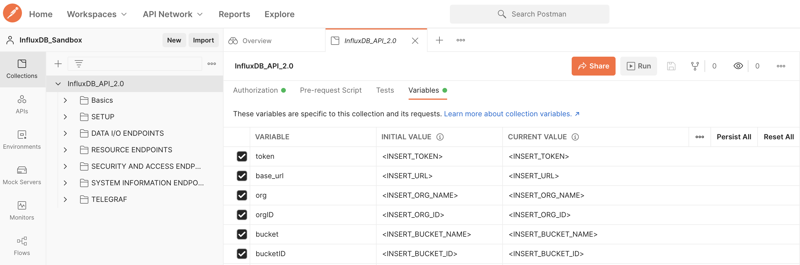

# Postman: InfluxDB API
The Postman InfluxDB project has been created to help you learn and experiment with the InfluxDB v2.0 API.  For an introduction to Postman and how we have used it, check out this [blog](insert_here)!

## Download and Import
**Download:** check out the official downloads [page](https://www.postman.com/downloads/).

**Project Import:** Once you have installed Postman follow these steps to import the project:

 - Create a new workspace. This can be done by clicking the `Create Workspace` button located under **Workspaces**.
 - In your new workspace click the `import` button located in the collections tab. This will open a import window with server options to choose from. 
 - Click on the tab called `Link`. Copy and paste the following URL: https://raw.githubusercontent.com/InfluxCommunity/postman_influx_v2_api/main/InfluxDB_API_2.0.postman_collection.json
 - Select `continue`. Select `Import`.
 
## Configuration
*Note: Check out the blog linked above for a deeper understanding of the collection setup.*
Before you start using the collection make sure to configure the collection **Variables**:
 - [ ] Token: Make sure to add your InfluxOSS / Cloud token here. This token will depend on the level of commands you wish to carry out via the API.
 - [ ] base_url: Add your InfluxDB instances address to this variable:
	 - OSS: http://localhost:8086 or http://<IP_of_DB>:8086 (Example)
	 - Cloud: https://us-east-1-1.aws.cloud2.influxdata.com/ (Example)

## Contributing
Pull requests are welcome. For major changes, please open an issue first to discuss what you would like to change.

Please make sure to update tests as appropriate.

## License
[Apache-2.0](https://www.apache.org/licenses/LICENSE-2.0)

